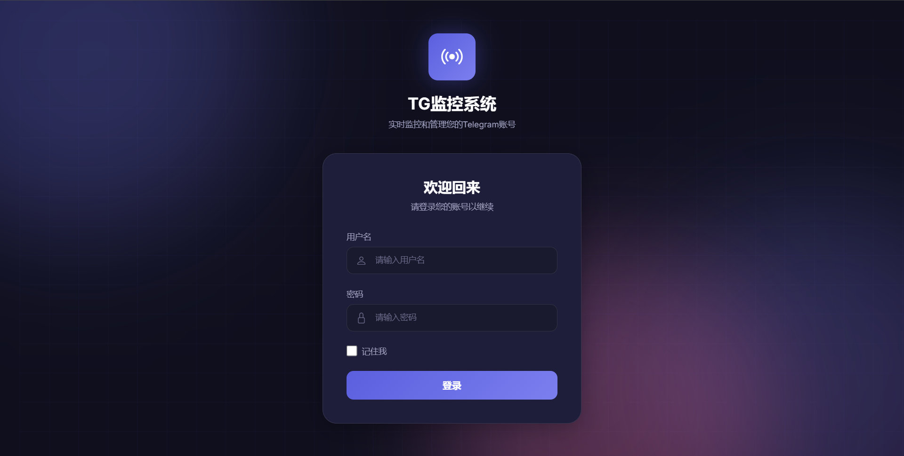
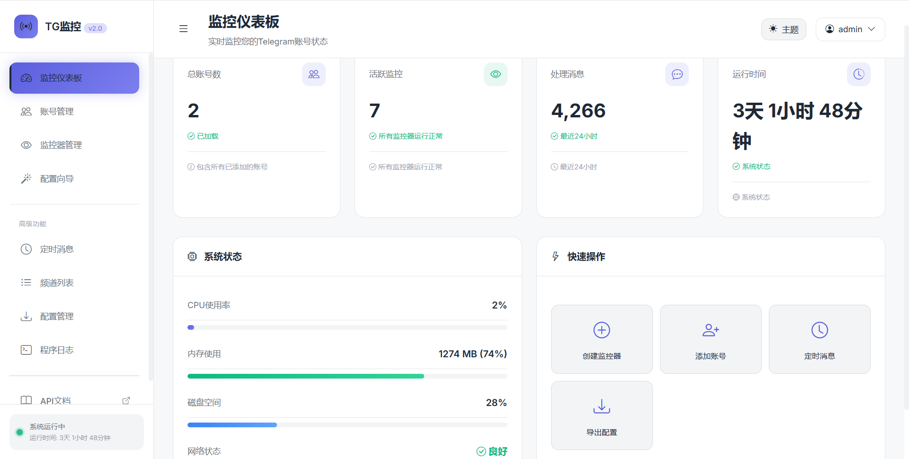
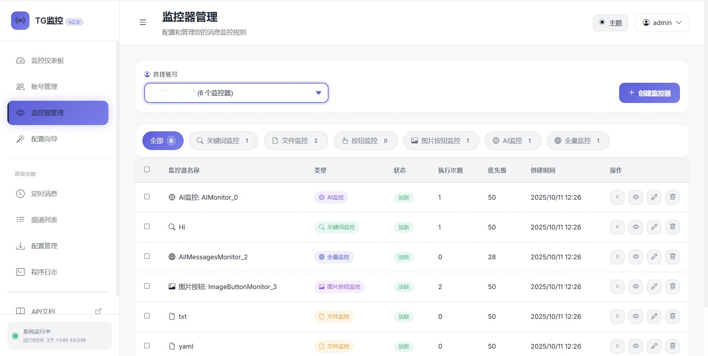

# TG监控系统 📱

一个功能强大的Telegram消息监控和自动化系统，支持多账号管理、智能AI分析、自动回复等功能。

## ✨ 主要功能

### 🎯 **监控功能**
- **关键词监控** - 支持精确匹配、包含匹配、正则表达式匹配
- **文件监控** - 监控指定类型的文件，支持大小过滤和自动保存
- **AI监控** - 基于OpenAI的智能消息分析和判断
- **图片+按钮监控** - AI分析文字或图片内容并自动点击对应按钮
- **全量消息监控** - 监控所有消息（支持聊天过滤）
- **按钮监控** - 手动或AI模式的按钮点击

### 🤖 **AI集成**
- **OpenAI支持** - 集成GPT模型进行智能分析
- **图片识别** - 支持图片内容分析和按钮选择
- **动态回复** - AI根据消息内容生成个性化回复

### 📧 **通知和转发**
- **邮件通知** - 支持SMTP邮件提醒
- **自动转发** - 普通转发和增强转发（下载重发）
- **智能过滤** - 基于用户、聊天、Bot等条件过滤

### ⚡ **自动化**
- **定时消息** - 支持Cron表达式的定时发送
- **自动回复** - 可配置延迟的智能回复
- **执行限制** - 监控器执行次数限制（暂停+重置机制）

### 🌐 **Web管理界面**
- **现代化界面** - 基于FastAPI的响应式Web界面
- **配置向导** - 图形化配置，无需编写代码
- **实时监控** - 查看监控状态、日志、统计信息
- **配置管理** - 导入/导出配置，批量管理

## 📸 界面预览

### 登录界面


### 仪表板


### 监控器管理


## 🚀 快速开始

### 环境要求

- Python 3.8+
- Telegram API 账号
- OpenAI API Key（可选，AI功能需要）

### 安装步骤

1. **克隆项目**
```bash
git clone https://github.com/djksps1/telegram-monitor.git
cd telegram-monitor
```

2. **安装依赖**
```bash
pip install -r requirements.txt
```

3. **配置环境**
```bash
# 复制配置模板
cp config.example.env .env

# 编辑配置文件
nano .env
```

4. **基础配置**
```env
# Telegram API (必须)
TG_API_ID=your_api_id
TG_API_HASH=your_api_hash

# OpenAI API (可选，AI功能需要)
OPENAI_API_KEY=your_openai_key
OPENAI_BASE_URL=https://api.openai.com/v1
OPENAI_MODEL=gpt-4o

# 邮件配置 (可选)
EMAIL_FROM=your@email.com
EMAIL_PASSWORD=your_password
EMAIL_TO=notify@email.com

# Web界面
WEB_HOST=127.0.0.1
WEB_PORT=8000
WEB_USERNAME=admin
WEB_PASSWORD=admin123
```

5. **启动系统**
```bash
# 启动Web界面
python3 web_app_launcher.py

# 公网访问模式
python3 web_app_launcher.py --public

# 调试模式
python3 web_app_launcher.py --debug
```

### 首次使用

1. 访问 `http://localhost:8000`
2. 使用 `admin/admin123` 登录（可在.env中修改）
3. 添加Telegram账号
4. 创建监控器配置
5. 开始监控！

## 📖 详细功能

### 监控器类型

| 类型        | 功能描述             | 适用场景           |
|-----------|------------------|----------------|
| **关键词监控** | 监控包含特定关键词的消息     | 品牌监控、敏感词检测     |
| **文件监控**  | 监控特定类型文件的分享      | 文档收集、资源监控      |
| **AI监控**  | 基于AI判断的智能监控      | 复杂语义分析、情感识别    |
| **图片+按钮** | AI分析文字或图片并自动点击按钮 | 验证码处理、bot签到自动化 |
| **全量监控**  | 监控所有消息           | 数据备份、全面监控      |

### 配置选项

#### **过滤条件**
- 监控特定聊天/群组/频道/Bot
- 过滤特定用户或Bot
- 支持白名单和黑名单机制

#### **执行模式**
- 合并模式：收集所有匹配的监控器，合并它们的动作后统一执行
- 全部独立执行模式：每个匹配的监控器都独立执行所有动作
- 首次匹配停止模式：匹配到第一个监控器后立即停止

#### **执行动作**
- 📧 **邮件通知** - 详细的匹配信息邮件
- 🔄 **自动转发** - 转发到指定聊天
- 💬 **自动回复** - 固定回复或AI生成回复
- 💾 **文件保存** - 自动下载并保存文件
- 📊 **日志记录** - 记录到指定文件

#### **高级选项**
- 🎯 **优先级控制** - 多监控器匹配时的执行顺序
- ⏱️ **延迟设置** - 随机延迟避免检测
- 🔢 **执行限制** - 达到次数后自动暂停
- 🎨 **回复模式** - 回复消息或直接发送


## ⚙️ 配置管理

### Web界面配置

1. **账号管理** - `/accounts` 
   - 添加/删除Telegram账号
   - 查看连接状态和监控状态

2. **监控器管理** - `/monitors`
   - 创建/编辑/删除监控器
   - 查看执行统计和状态

3. **定时消息** - `/scheduled`
   - 配置定时发送任务
   - 支持Cron表达式

4. **系统状态** - `/`
   - 查看系统运行状态
   - 监控统计和日志

### 配置导入导出

支持JSON格式的配置导入导出，方便批量管理和备份：


## 🔧 高级配置

### AI功能配置

```env
# OpenAI配置
OPENAI_API_KEY=sk-xxx
OPENAI_BASE_URL=https://api.openai.com/v1
OPENAI_MODEL=gpt-4o

# 自定义API端点
OPENAI_BASE_URL=https://your-proxy.com/v1
```

### 邮件通知配置

```env
# SMTP配置
EMAIL_SMTP_SERVER=smtp.qq.com
EMAIL_SMTP_PORT=465
EMAIL_FROM=your@qq.com
EMAIL_PASSWORD=your_app_password
EMAIL_TO=notify@email.com
```

### 安全配置

```env
# Web界面安全
WEB_USERNAME=your_username
WEB_PASSWORD=your_strong_password
SECRET_KEY=your_secret_key

# 访问控制
WEB_HOST=127.0.0.1  # 仅本地访问
# WEB_HOST=0.0.0.0  # 允许外网访问（谨慎使用）
```


## 🛠️ 故障排除

### 常见问题

**Q: 无法连接Telegram账号**
A: 检查TG_API_ID和TG_API_HASH配置，确保网络连接正常

**Q: AI功能不工作**
A: 检查OPENAI_API_KEY配置，确保API额度充足

**Q: 邮件通知失败**
A: 检查SMTP配置，确保邮箱开启了应用密码

**Q: Web界面无法访问**
A: 检查防火墙设置，确保端口8000未被占用


## 🏗️ 项目结构

```
tg-monitor/
├── core/              # 核心功能模块
│   ├── account_manager.py    # 账号管理
│   └── monitor_engine.py     # 监控引擎
├── monitors/          # 监控器实现
│   ├── keyword_monitor.py    # 关键词监控
│   ├── ai_monitor.py         # AI监控
│   ├── file_monitor.py       # 文件监控
│   └── image_button_monitor.py # 图片按钮监控
├── services/          # 外部服务
│   ├── ai_service.py         # AI服务
│   └── enhanced_forward_service.py # 增强转发
├── ui/               # Web界面
│   ├── web_app.py           # FastAPI应用
│   ├── config_wizard.py     # 配置向导
│   └── templates/           # HTML模板
├── models/           # 数据模型
├── utils/            # 工具函数
├── data/             # 数据存储
├── logs/             # 日志文件
└── downloads/        # 下载文件
```

## 🤝 贡献

欢迎提交Issue和Pull Request！

### 开发环境

```bash
# 克隆代码
git clone https://github.com/your-username/tg-monitor.git

# 安装开发依赖
pip install -r requirements-dev.txt

# 运行测试
python3 web_app_launcher.py --public


```

### 提交规范

- 功能: `feat: 添加新的监控类型`
- 修复: `fix: 修复AI监控器的bug`
- 文档: `docs: 更新README.md`

## 📄 许可证

MIT License - 详见 [LICENSE](LICENSE) 文件

## ⚠️ 安全注意事项

### 强烈建议
- 🔐 **修改默认密码** - 首次使用时务必在.env中设置强密码
- 🔒 **保护敏感文件** - 确保.env和*.session文件不被提交到Git
- 🌐 **限制网络访问** - 生产环境建议设置 `WEB_HOST=127.0.0.1`
- 🔑 **定期更换密钥** - 定期更换API密钥和Web登录密码

### 文件权限
```bash
# 设置敏感文件权限（Linux/Mac）
chmod 600 .env
chmod 600 *.session
```

## ⚠️ 免责声明

- 本工具仅供学习和合法用途使用
- 请遵守Telegram服务条款和当地法律法规
- 使用AI功能时请注意API使用费用
- 建议在安全的网络环境中使用

## 🔗 相关链接

- [Telegram API 文档](https://core.telegram.org/api)
- [OpenAI API 文档](https://platform.openai.com/docs)
- [FastAPI 文档](https://fastapi.tiangolo.com/)

## 📊 系统特性

### 性能优化
- ⚡ **高速响应** - 关键词匹配到回复仅需100-300ms
- 🔄 **异步处理** - 邮件发送等操作不阻塞主流程
- 💾 **内存优化** - 智能的消息去重和缓存管理

### 可靠性
- 🛡️ **错误恢复** - 完善的异常处理和回退机制
- 📝 **详细日志** - 分级日志系统，便于故障排查
- 🔒 **单例模式** - 避免资源竞争和重复初始化

### 扩展性
- 🔌 **模块化设计** - 监控器采用策略模式，易于扩展
- 🏭 **工厂模式** - 统一的监控器创建和管理
- 🎛️ **配置化** - 所有功能都可通过配置调整

---

**开始您的Telegram自动化之旅！** 🚀

如有问题或建议，欢迎提交Issue或联系开发者。
